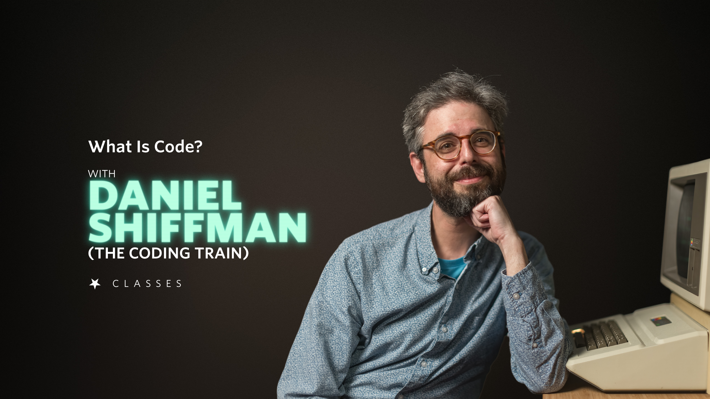

# Nebula Class - What is Code?

This repository includes all the source code and related links/resources mentioned in the videos.

To sign up for Nebula Classes: [http://nebulaclasses.com/codingtrain](http://nebulaclasses.com/codingtrain)

This repository also contains [the accompanying source code for the Snake Game](snake) from the Coding Challenge YouTube video (link to come).

## Outline

1. Introduction
   - [Coding Train](https://thecodingtrain.com/)
   - [IMA/ITP, Tisch, NYU](https://tisch.nyu.edu/itp)
2. What is Programming?
3. Pseudocode
   - [Fractal Tree](https://editor.p5js.org/codingtrain/sketches/fcGXLO7Oy)
   - [John Henry Thompson](<https://en.wikipedia.org/wiki/John_Thompson_(inventor)>)
   - [Lingo](<https://en.wikipedia.org/wiki/Lingo_(programming_language)>)
   - [Scratch](https://scratch.mit.edu/)
4. Programming Languages
   - [Processing](https://processing.org/)
   - [p5.js](https://p5js.org/)
   - [Processing Foundation](https://processingfoundation.org/)
5. Applesoft Basic
   - [Apple II](https://en.wikipedia.org/wiki/Apple_II)
   - [AppleSoft BASIC](https://en.wikipedia.org/wiki/Applesoft_BASIC)
6. Hello, World
   - [Programming in C - A Tutorial](https://www.bell-labs.com/usr/dmr/www/ctut.pdf)
   - [AppleSoft Basic Emulator](https://www.calormen.com/jsbasic/)
7. Variables
8. Conditionals
   - [George Boole](https://en.wikipedia.org/wiki/George_Boole)
9. Loops
10. Arrays
11. Functions
12. Putting It All Together
    - [Typing Tutor](https://www.old-computers.com/museum/software_detail.asp?c=18&st=1&id=728)
    - [ASCII Table](https://www.asciitable.com/)
    - [Unicode](https://home.unicode.org/)
    - [VSCode](https://code.visualstudio.com/)
    - [Play the Typing Tutor Game!](https://editor.p5js.org/codingtrain/full/YRNyv1Hsl)
13. Conclusion
    - [JavaScript](https://developer.mozilla.org/en-US/docs/Web/JavaScript)
    - [Python](https://www.python.org/)
    - [Processing](https://www.python.org/)
    - [p5.js](https://p5js.org/)
    - [Coding Train Beginner Playlist](https://www.youtube.com/playlist?list=PLRqwX-V7Uu6Zy51Q-x9tMWIv9cueOFTFA)
    - [All Coding Train resources and videos](https://thecodingtrain.com/)
